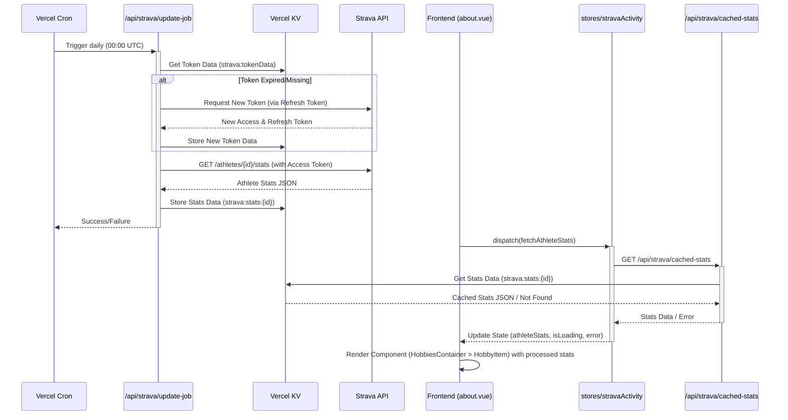

# Strava Data Integration Architecture

This document outlines the end-to-end architecture for fetching Strava activity data, caching it, and displaying it within the portfolio application.

## Flow Overview

The system is designed to fetch Strava stats periodically in the background, cache them using Vercel KV, and serve the cached data to the frontend to avoid hitting Strava API rate limits on every page load and ensure fast data availability.

## Components

1.  **Strava API Application (External)**
    *   A Strava application needs to be created at [strava.com/settings/api](https://www.strava.com/settings/api).
    *   This provides the `Client ID` and `Client Secret`.
    *   An initial `Refresh Token` must be obtained through an initial OAuth authorization flow (this is typically a one-time manual process or a separate setup script).
    *   The `Owner ID` (your Strava athlete ID) is also required.
    *   These credentials (`STRAVA_CLIENT_ID`, `STRAVA_CLIENT_SECRET`, `STRAVA_REFRESH_TOKEN`, `MY_STRAVA_OWNER_ID`) must be stored securely as Environment Variables in Vercel.

2.  **Vercel Cron Job (`[vercel.json](mdc:vercel.json)`)**
    *   A cron job is defined in `vercel.json`.
    *   **Schedule:** Runs daily at midnight UTC (`0 0 * * *`).
    *   **Target:** Triggers the `/api/strava/update-job` serverless function endpoint.
    *   **Authentication:** The cron job relies on a `CRON_SECRET` environment variable for security. The `update-job` endpoint checks the `Authorization: Bearer <CRON_SECRET>` header.

3.  **Backend Update Job (`[server/api/strava/update-job.ts](mdc:server/api/strava/update-job.ts)`)**
    *   **Authorization:** Verifies the `Authorization` header against the `CRON_SECRET`.
    *   **Token Management:**
        *   Retrieves the current token data (access token, refresh token, expiry time) from Vercel KV using the key `strava:tokenData`.
        *   If the token is missing or expired (within a 10-minute buffer), it uses the stored refresh token to request a new access token and refresh token from the Strava OAuth endpoint (`https://www.strava.com/oauth/token`).
        *   Saves the updated token data back to Vercel KV.
    *   **Data Fetching:**
        *   Uses the valid access token to make a GET request to the Strava API endpoint `https://www.strava.com/api/v3/athletes/{ownerId}/stats`.
    *   **KV Caching:**
        *   Stores the retrieved `StravaAthleteStats` JSON response in Vercel KV.
        *   The key used is `strava:stats:{ownerId}` (e.g., `strava:stats:12345678`).
    *   **Error Handling:** Logs errors during token refresh or API fetching. Handles potential `Authorization Error` responses from Strava by clearing the potentially invalid token from KV for the next run.

4.  **Frontend API Endpoint (`[server/api/strava/cached-stats.get.ts](mdc:server/api/strava/cached-stats.get.ts)`)**
    *   This is a simple GET endpoint used by the frontend.
    *   It retrieves the cached `StravaAthleteStats` directly from Vercel KV using the `strava:stats:{ownerId}` key.
    *   If no data is found in KV (e.g., the cron job hasn't run successfully yet), it returns a specific error structure (`{ error: 'No cached Strava stats found.', data: null }`) with a 404 status.
    *   Handles potential KV errors and returns a 500 status.

5.  **Pinia Store (`[stores/stravaActivity.ts](mdc:stores/stravaActivity.ts)`)**
    *   **State:** Manages `athleteStats`, `isLoading`, and `error`.
    *   **Action (`fetchAthleteStats`):**
        *   Sets `isLoading` to true.
        *   Makes a `$fetch` request to the internal `/api/strava/cached-stats` endpoint.
        *   Updates `athleteStats` with the response data if successful.
        *   Handles the specific "Not Found" error from the backend API, setting a user-friendly error message.
        *   Catches other fetch errors and updates the `error` state.
        *   Sets `isLoading` to false in a `finally` block.
    *   **Getter (`fitnessStats`):**
        *   Transforms the raw `athleteStats` data into the `HobbyStats[]` format required by the frontend components.
        *   Handles `isLoading` and `error` states by returning appropriate placeholder stats.
        *   Performs calculations (e.g., converting distance from meters to miles).
        *   Formats the output string (e.g., `"{distance}mi / {count} runs"`).

6.  **Frontend Components**
    *   **`[pages/about.vue](mdc:pages/about.vue)`:**
        *   Initializes the `useStravaActivityStore`.
        *   Calls the `fetchAthleteStats` action in its `onMounted` hook.
        *   Uses a `computed` property (`hobbies`) to merge the static hobby data with the dynamic `fitnessStats` from the Pinia store getter.
        *   Passes the combined `hobbies` array to the `HobbiesContainer`.
    *   **`[components/HobbiesContainer.vue](mdc:components/HobbiesContainer.vue)`:**
        *   Receives the `hobbies` array as a prop.
        *   Iterates over the array and renders a `HobbyItem` for each hobby.
    *   **`[components/HobbyItem.vue](mdc:components/HobbyItem.vue)**:
        *   Receives a single `hobby` object as a prop.
        *   Displays the hobby's name, description, and iterates through the `hobby.stats` array to display each statistic (label and value).
        *   Includes a specific link to the Strava profile for the 'fitness' hobby.

## Environment Variables Required

*   `CRON_SECRET`: A secret string to authenticate the cron job trigger.
*   `STRAVA_CLIENT_ID`: Your Strava application's Client ID.
*   `STRAVA_CLIENT_SECRET`: Your Strava application's Client Secret.
*   `STRAVA_REFRESH_TOKEN`: An initial, valid refresh token for your Strava account.
*   `MY_STRAVA_OWNER_ID`: Your numeric Strava Athlete ID.
*   Vercel KV environment variables are automatically injected by Vercel (`KV_URL`, `KV_REST_API_URL`, `KV_REST_API_TOKEN`, `KV_REST_API_READ_ONLY_TOKEN`).

This setup ensures that Strava data is displayed efficiently and reliably without overburdening the Strava API or requiring client-side authentication. 