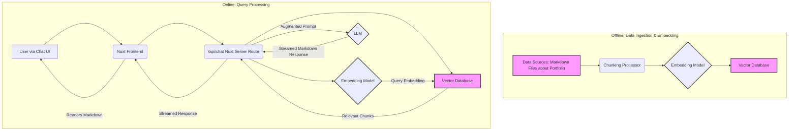

# Portfolio Chatbot RAG Architecture

## 1. Overview

This document outlines the architecture for a Retrieval-Augmented Generation (RAG) system to power a portfolio chatbot. The chatbot will answer questions about the user's work experience, projects, skills, and other relevant professional information. It will leverage a pre-defined dataset of information about the user, processed into embeddings and stored in a vector database. The system will use Nuxt.js for the frontend and backend, with the Vercel AI SDK for core AI functionalities.

## 2. Product Requirements

*   AI responses must support streaming for a real-time feel.
*   AI responses must support Markdown for rich text formatting.
*   The AI should primarily answer questions relevant to the user's professional profile (work experience, projects, skills, etc.).
*   Answers should be accurate and based on the provided information.
*   If a question is outside the scope of the portfolio information or the AI cannot find a relevant answer, it should indicate so gracefully.

## 3. Proposed Tech Stack

*   **Frontend:** Nuxt.js (Vue 3, TypeScript, TailwindCSS, Shadcn Vue, Radix Vue) - Leveraging existing chat components (`ChatInput.vue`, `ChatMessage.vue`, `ChatInterface.vue`, `ChatSheet.vue`).
*   **Backend:** Nuxt.js Server Routes (API endpoints).
*   **AI Orchestration:** Vercel AI SDK (preferred for Vercel/Nuxt.js integration, streaming, and tool usage). Langchain.js is a viable alternative.
*   **LLM:** A capable model from OpenAI (e.g., `gpt-3.5-turbo`, `gpt-4o`, `gpt-4o-mini`) or Anthropic (e.g., Claude 3 models) via Vercel AI SDK.
*   **Embedding Model:** OpenAI `text-embedding-3-small` or `text-embedding-ada-002` via Vercel AI SDK, or a suitable Sentence Transformer model.
*   **Vector Database:**
    *   **Primary Recommendation:** Vercel Postgres with the `pgvector` extension. This integrates seamlessly with Vercel hosting and the Vercel AI SDK examples.
    *   **Alternative:** Upstash Vector. Another serverless option with good Vercel AI SDK integration.
*   **Data Source for Embeddings:** Manually curated Markdown files containing information about the user (e.g., `about-me.md`, `work-experience.md`, `projects.md`, `skills.md`).

## 4. System Architecture

The RAG system will consist of two main parts: an offline data ingestion/embedding pipeline and an online query processing pipeline.



### 4.1. Offline: Data Ingestion & Embedding Pipeline

This process is done upfront and whenever the portfolio information needs updating.

1.  **Data Preparation:**
    *   Create/update Markdown files (`*.md`) in a dedicated directory (e.g., `content/portfolio-data/`). Each file could represent a section like "About Me," "Work Experience," "Projects," "Skills," etc.
    *   Structure content clearly for optimal chunking and retrieval.
2.  **Chunking:**
    *   A script (Node.js or Python, runnable locally or as a build step) will load the Markdown files.
    *   The content of these files will be split into smaller, semantically coherent chunks. The Vercel AI SDK or Langchain.js text splitters can be used (e.g., `RecursiveCharacterTextSplitter` for generic text, or a Markdown-specific splitter).
    *   Aim for chunks that are not too small (losing context) or too large (diluting relevance and exceeding embedding model limits).
3.  **Embedding Generation:**
    *   For each chunk, generate a vector embedding using the chosen embedding model (e.g., OpenAI `text-embedding-3-small` via Vercel AI SDK's `embedMany` function).
4.  **Storage:**
    *   Store each text chunk and its corresponding embedding in the chosen vector database (e.g., Vercel Postgres with `pgvector`). The table would typically include `id`, `chunk_text`, and `embedding_vector` columns.

### 4.2. Online: Query Processing Pipeline (Handled by Nuxt Server Route)

This happens in real-time when a user interacts with the chatbot.

1.  **User Query:** The user types a question into the chat interface.
2.  **Frontend Request:** The Nuxt/Vue frontend (using Vercel AI SDK's `useChat` hook) sends the user's query and chat history to a Nuxt server route (e.g., `/api/chat`).
3.  **Query Embedding:** The server route uses the same embedding model used for the data ingestion to generate an embedding for the user's current query.
4.  **Vector Search (Retrieval):**
    *   The query embedding is used to search the vector database.
    *   The search (e.g., cosine similarity) identifies the top N most relevant text chunks from the stored portfolio information.
    *   The Vercel AI SDK's RAG guide demonstrates how to perform this search against `pgvector`.
5.  **Context Augmentation & Prompt Construction:**
    *   The retrieved text chunks (the "context") are combined with the user's original query to form a detailed prompt for the LLM.
    *   A system prompt will instruct the LLM on its role, how to use the provided context, the desired tone, and how to handle out-of-scope questions. Example:
        ```
        You are a helpful AI assistant for [User's Name]'s portfolio.
        Answer the user's question based ONLY on the provided context.
        If the context doesn't contain the answer, say "I'm sorry, I don't have that specific information in my knowledge base."
        Format your answers in Markdown. Be concise and professional.

        Context:
        ---
        [Retrieved Chunk 1 Text]
        ---
        [Retrieved Chunk 2 Text]
        ---
        ...

        User Question: [User's Original Question]
        ```
6.  **LLM Interaction (Generation):**
    *   The augmented prompt is sent to the chosen LLM (e.g., `gpt-4o-mini`) via the Vercel AI SDK (e.g., using `streamText`).
    *   The Vercel AI SDK will handle streaming the LLM's response back.
7.  **Response Streaming & Rendering:**
    *   The Nuxt server route streams the Markdown response from the LLM back to the frontend.
    *   The `useChat` hook on the frontend receives the streamed data and updates the UI, rendering the Markdown content in the `ChatMessage.vue` component.

## 5. Answering Outstanding Questions

### 5.1. How do I want to create these initial embeddings in an easy way?

1.  **Prepare Content:**
    *   Create a set of Markdown files (`.md`) in your project, perhaps in a `content/portfolio_data/` directory.
    *   Examples: `introduction.md`, `experience_company_a.md`, `project_x.md`, `skills_frontend.md`.
    *   Write naturally, but keep information organized for better chunking.
2.  **Script for Ingestion:**
    *   Create a script (e.g., `scripts/ingest-data.ts` or `scripts/ingest_data.py`) that:
        *   Reads all Markdown files from the specified directory.
        *   Uses a text splitter (from Vercel AI SDK or Langchain) to break down the content into manageable chunks. Consider `RecursiveCharacterTextSplitter` or a Markdown-specific splitter.
        *   Uses the Vercel AI SDK's `embedMany` function (with your chosen OpenAI embedding model) to generate embeddings for all chunks.
        *   Connects to your vector database (e.g., Vercel Postgres).
        *   Inserts each chunk and its corresponding embedding into the database.
    *   This script can be run manually whenever your portfolio information changes. For more automation, it could be part of a build or deployment process.

    **Example Snippet (Conceptual - using Vercel AI SDK style):**
    ```typescript
    // In your ingest script (e.g., scripts/ingest-data.ts)
    import { embedMany } from 'ai';
    import { openai } from '@ai-sdk/openai'; // Or your chosen embedding provider
    import { createClient } from '@vercel/postgres'; // Or your DB client
    import fs from 'fs/promises';
    import path from 'path';
    // Assume a simple text splitter function or import one
    // function splitTextIntoChunks(text: string, chunkSize: number, chunkOverlap: number): string[] { ... }

    async function main() {
      const portfolioDataDir = path.join(process.cwd(), 'content', 'portfolio_data');
      const files = await fs.readdir(portfolioDataDir);
      const textsToEmbed: string[] = [];

      for (const file of files) {
        if (file.endsWith('.md')) {
          const content = await fs.readFile(path.join(portfolioDataDir, file), 'utf-8');
          // Add chunking logic here, e.g., using a text splitter
          // For simplicity, let's assume content is already chunked or small enough
          // In reality, use a proper text splitter:
          // const chunks = splitTextIntoChunks(content, 500, 50);
          // textsToEmbed.push(...chunks);
          textsToEmbed.push(content); // Simplified for example
        }
      }

      if (textsToEmbed.length === 0) {
        console.log("No text found to embed.");
        return;
      }

      const embeddingModel = openai.embedding('text-embedding-3-small');
      const { embeddings } = await embedMany({
        model: embeddingModel,
        values: textsToEmbed,
      });

      const dbClient = createClient({ connectionString: process.env.POSTGRES_URL_NON_POOLING }); // Example
      await dbClient.connect();

      // Assuming a table 'portfolio_embeddings' with columns: id, text_content, embedding (vector)
      for (let i = 0; i < embeddings.length; i++) {
        const text = textsToEmbed[i];
        const embedding = embeddings[i];
        // Ensure embedding is in the format pgvector expects, e.g., "[0.1,0.2,...]"
        const vectorString = '[' + embedding.join(',') + ']';
        await dbClient.query(
          'INSERT INTO portfolio_embeddings (text_content, embedding) VALUES ($1, $2)',
          [text, vectorString]
        );
      }
      console.log(`Successfully embedded and stored ${embeddings.length} chunks.`);
      await dbClient.end();
    }

    main().catch(console.error);
    ```

### 5.2. What vector DB should I store these embeddings for this RAG system?

*   **Vercel Postgres with `pgvector`:**
    *   **Pros:** Excellent integration with the Vercel ecosystem if you're hosting there. Serverless, scales with your usage. Good documentation and examples exist for Vercel AI SDK. Standard SQL database with vector capabilities, so you can use it for other application data too.
    *   **Cons:** `pgvector` might not be as feature-rich or performant at extreme scales as some dedicated vector DBs, but for a portfolio site, it's likely more than sufficient and cost-effective.
    *   **Setup:** Enable the `vector` extension in your Vercel Postgres instance. Define a table to store your embeddings (e.g., `text_content TEXT`, `embedding VECTOR(1536)` if using `text-embedding-ada-002` or `text-embedding-3-small`). Create an index (e.g., HNSW or IVFFlat) on the `embedding` column for efficient similarity search.

*   **Upstash Vector:**
    *   **Pros:** Fully serverless, pay-as-you-go. Designed for simplicity and ease of use. Good integration with Vercel AI SDK. Can automatically handle embedding generation if desired (though for this project, you'll likely generate them with your chosen model via Vercel AI SDK).
    *   **Cons:** Another service to manage (though simple).
    *   **Setup:** Create an Upstash Vector database. Use their SDK to upsert data (ID, vector, metadata).

*   **Other options (Pinecone, Weaviate, Milvus, ChromaDB):** These are powerful dedicated vector databases. They offer more advanced features but might be overkill and introduce more complexity/cost for a portfolio chatbot. They are excellent choices for larger-scale RAG applications.

**Recommendation for this project:** Start with **Vercel Postgres + `pgvector`**. It aligns well with a Nuxt.js app likely deployed on Vercel and has strong support within the Vercel AI SDK.

## 6. Key Considerations

*   **Prompt Engineering:** The quality of your system prompt is crucial for guiding the LLM to use the context effectively and respond appropriately, especially for handling out-of-scope questions.
*   **Chunking Strategy:** Experiment with chunk size and overlap. Chunks that are too small may lack context, while chunks that are too large may dilute the relevant information and hit token limits. Markdown-aware chunking can be beneficial.
*   **Relevance Tuning:** The number of retrieved chunks (top K) passed to the LLM might need tuning. Too few might miss information; too many can increase cost and potentially confuse the LLM.
*   **"I don't know" responses:** Ensure the LLM is reliably saying it doesn't know when the context doesn't support an answer, rather than hallucinating. The system prompt is key here.
*   **Data Updates:** When your portfolio information changes, you'll need to re-run the ingestion script to update the embeddings in the vector database.
*   **Cost:** Be mindful of API costs for embedding generation (one-time per chunk update) and LLM calls (per query). Choose models and manage usage accordingly.
*   **Error Handling:** Implement robust error handling in the API route.

## 7. Future Enhancements (Optional)

*   **Hybrid Search:** Combine vector search with keyword search for certain types of queries.
*   **Re-ranking:** Add a step to re-rank the retrieved chunks using a more sophisticated model before sending them to the LLM.
*   **Conversational Memory:** Improve how chat history is incorporated into the retrieval query (e.g., query rewriting based on history). Vercel AI SDK's `useChat` handles basic history.
*   **Admin Interface:** A simple UI to upload/manage Markdown content and trigger re-ingestion.

## 8. Next Steps

1.  **Set up Data Source:** Create initial Markdown files with your portfolio information.
2.  **Choose & Set up Vector DB:** Provision Vercel Postgres and enable `pgvector`, or set up an Upstash Vector DB. Create the necessary table and vector index.
3.  **Develop Ingestion Script:** Write and test the script to load, chunk, embed, and store your portfolio data.
4.  **Develop Nuxt Server Route:**
    *   Implement the API endpoint (`/api/chat`).
    *   Integrate query embedding, vector search, prompt construction, and LLM call using Vercel AI SDK.
    *   Ensure streaming and Markdown support.
5.  **Integrate Frontend:** Ensure the existing chat UI (`useChat` hook) correctly calls the new API endpoint and renders streamed Markdown responses.
6.  **Test Thoroughly:** Test with various questions, including those on the edge of or outside your provided data.
7.  **Refine:** Adjust chunking, prompts, and model choices based on testing.

This architecture provides a solid foundation for your portfolio chatbot. Good luck! 